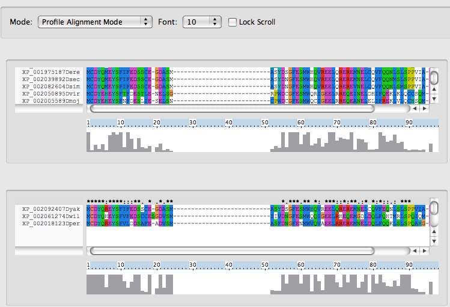
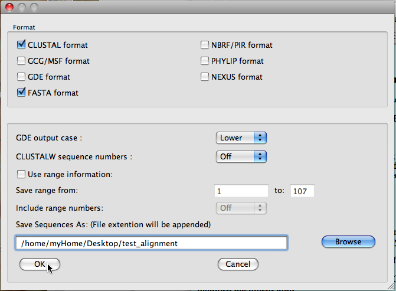

# Using CLUSTALX

------------------------------------------------------------------------

- [Introduction](#Introduction)
- [Documentation and tutorials](#Documentation_and_tutorials_)
- [Getting CLUSTALX](#Getting_CLUSTALX_)
- [Overview of CLUSTALX Graphical User Interface (GUI)] (#Overview_of_CLUSTALX_Graphical_User)
- [Opening a sequence file](#Opening_a_sequence_file)
- [Writing MSA output files - changing the format of an MSA](#Writing_MSA_output_files_-_changing_the)
- [Saving alignments in PHYLI format](#Saving_alignments_in_PHYLIP_format)
- [Identifying poorly-aligned regions of an MSA - using the "Show Low-Scoring Segments" option](#Identifying_poorly-aligned_regions_of_an)
- [Removing/deleting sequences from the alignment](#Removingdeleting_sequences_from_an)
- [Adding (and aligning) sequences to a pre-existing alignment](#Adding_and_aligning_sequences_to_a)
- [Applying the CLUSTAL alignment algorithm](#Applying_the_CLUSTAL_alignment_algorithm)
- [Estimating phylogeny using CLUSTALX](#Estimating_phylogeny_using_CLUSTALX)
- [Preserving input sequence order during alignment](#Preserving_input_sequence_order_during_)
- [Obtaining a matrix of pairwise identities](#Obtaining_a_matrix_of_pairwise)
- [CLUSTALX output formats and file extensions](#CLUSTALX_output_formats_and_file)

------------------------------------------------------------------------

### Introduction

CLUSTALX provides a graphical user interface to the CLUSTALW multiple sequence alignment (MSA) algorithm.

The original publications describing [CLUSTALX](http://www.ncbi.nlm.nih.gov/pubmed/9396791) and [CLUSTALW](http://www.ncbi.nlm.nih.gov/pubmed/7984417) are some of the highest-cited papers ever - when they were released they provided a major increase in the accuracy and speed with which users could build MSAs, with the focus on protein sequences - in the case of CLUSTALX additionally packaged in an easy-to-use graphical user interface (GUI) - leading to their great popularity.

There are now several other pieces of MSA software that are, for many sets of sequences and analyses, a better choice than CLUSTALX if your aim is to obtain an MSA of a set of protein sequences - and certainly if you are aligning DNA sequences (something CLUSTALW/X has never focused on).

However, despite this, CLUSTALX remains useful - partly because in some circumstances it still does a good job at aligning sequences (judged by todays standards) - but perhaps most importantly due to several features of the GUI that provide easy-to-use interfaces to several key tasks that are needed in many cases to build a good MSA.

The notes supplied here focus on some of the more important of these additional features.

### Documentation and tutorials

The [documentation file](http://bips.u-strasbg.fr/fr/Documentation/ClustalX/) for CLUSTALX is available online from the University of Strasbourg.

Several articles have been published that provide tutorials and advice on using CLUSTALX - a list of them [can be found here](http://www.clustal.org/#Documentation) on the [CLUSTAL homepage](http://www.clustal.org/).

[This is a link to a PDF describing a CLUSTALX tutorial](http://bioinf.ncl.ac.uk/molsys/practical/ClustalX%20Practical.pdf) as part of the [Molecular Systematics and Evolution workshop](http://bioinf.ncl.ac.uk/molsys/index.html) run annually in Rio de Janeiro, Brazil.

[This is a link to Jacques van Helden's phylogenetics tutorial](http://www.bigre.ulb.ac.be/Users/jvanheld/bioinformatics_introductory_course/web_course/practicals/phylogeny.html#contents) that includes sequence alignment using CLUSTALX.

### Getting CLUSTALX

CLUSTALX can be[downloaded here](http://bips.u-strasbg.fr/fr/Documentation/ClustalX/) from the University of Strasbourg.

It is also available [here](http://www.clustal.org/#Download) from the [CLUSTAL home page](http://www.clustal.org/)

A [web interface to CLUSTALW](http://www.ebi.ac.uk/Tools/clustalw2/index.html) can be found here at the EMBL-EBI.

### Overview of CLUSTALX Graphical User Interface (GUI)

 The image above shows the main features of the CLUSTALX GUI.

The **Menu Bar** provides access to a range of different features and actions that can be applied to the alignment e.g. saving an alignment, adjusting the colouring scheme etc.

- In these instructions, menus and menu options are indicated using italics

The **Mode Drop-Down Box** is used to switch between **Multiple Alignment Mode** (as shown above) and **Profile Alignment Mode** (see image below)

- Note that some menu options are only available in either **Multiple Alignment Mode** or **Profile Alignment Mode**

The **Font Size Drop-Down Box** is used to specify the size of the font used to represent the sequences in the **Alignment Display Area**

The identifiers of the sequences shown in the alignment are displayed in the **Sequence Identifier Panel**

The **Consensus Line** provides a summary of the degree of conservation of residues in the corresponding alignment column

- ‘*’ (identical residues in all sequences)
- ‘:’ (highly conserved column)
- ‘.’ (weakly conserved column)

The **Alignment Ruler** indicates the position in the alignment (with the first column assigned position 1 etc.) of a given column shown in the **Alignment Display Area**

The **Alignment Conservation Display Area** provides a bar chart indicating the degree of conservation of each column in the alignment.

The image below shows CLUSTALX in **Profile Alignment Mode**, where the sequences in the alignment are divided between an upper ("**Profile 1**") and a lower ("**Profile 2**") **Alignment Display Areas,** each accompanied by its own **Sequence Identifier Panel, Consensus Line**, **Alignment Ruler** and **Alignment Conservation Display Area** 
\

### Opening a sequence file

Using the CLUSTALX menu bar:

 **File-&gt;Load Sequences**
 
Then select the MSA file on your local file system that you want to load into CLUSTALX.

All gaps need to be coded as "-" characters. Some sources of pre-calculated alignments code gaps as "." characters - if you are working with such an alignment, you will need to replace all "." characters by "-", which should be easy using a text editor's Replace All functionality.

Note also that CLUSTALX accepts sequence identifiers containing a reasonably diverse set of characters, but the text shown in the Sequence Identifier Panel is only the first word of the descriptor provided in the input file i.e. the identifier is shown only until the first whitespace in the input file sequence identifiers.

### Writing MSA output files - changing the format of an MSA

CLUSTALX can write an MSA to an output file in several different
formats.

To specify the format of an output file use the Menu Bar: 

 *File-&gt;Save Sequences as...*

In the window that appears, in the format field, check the boxes next to the formats you want to use for your output file(s) - if you select several boxes, then CLUSTALX will write multiple files, one for each of the different formats you specify. The names of these files are specified using the path provided in the **Save Sequences As: (File extension will be appended)** text box, with appropriate extensions [as described below](#CLUSTALX_output_formats_and_file) to indicate which file constrains the alignment in which format.

To save the alignment, click the "OK" button.

** IMPORTANT NOTE! If you load a file into CLUSTALX, modify the alignment in some way, and then save the modified alignment in the same format as the file you loaded into the software, by default CLUSTALX will overwrite your initial alignment file with the modified alignment.**

Often you will want to preserve the initial alignment file!

Therefore, either initially load into CLUSTALX a COPY of the file you want to modify, or **be careful to change the name of the file you save the modified alignment into.**

For example, in the image shown below, CLUSTALX will write two files **(test\_alignment.aln** in CLUSTAL format and **test\_alignment.fasta** in FASTA format) in the directory **/home/myHome/Desktop ** 

As CLUSTALX accepts as input and writes as output MSAs in several different formats, it can function as an MSA sequence format convertor - loading an alignment in one format into CLUSTALX, and saving it in a different format.

Given the diversity of MSA formats available, the user-friendliness of the CLUSTALX interface, and the relatively robust input sequence format parser of CLUSTALX (e.g. it allows long identifier names containing special characters such as "|", unlike much MSA software), CLUSTALX is often used simply to carry out this fairly basic yet important operation.

### Saving alignments in PHYLIP format

As [outlined above](#Writing_MSA_output_files_-_changing_the), CLUSTALX can be used to convert alignment formats.

Much software that processes MSAs in a phylogenetic context accepts the MSAs as input in PHYLIP format.

Additionally, much of this software only accepts PHYLIP format where sequence identifiers are restricted in length to a maximum of 10 characters.

Therefore, to maintain compatibility with such software, CLUSTALX truncates the sequence identifiers used in writing PHYLIP format alignment files to a maximum of 10 characters - this is done by discarding all by the first 10 characters from the sequence identifiers supplied in the input MSA file.

In some cases this can cause problems, as most MSA/phylogenetics software requires that the identifiers used in their input alignments are unique - i.e. the software will not accept alignments where the same identifier is associated with more than one sequence - and following such truncation, in some cases the sequence identifiers are no longer unique.

Therefore, before using CLUSTALX to export to PHYLIP format, it is usually a good idea to edit a FASTA format version of the alignment file using a text editor so that all sequence identifiers are:

- unique
- contain a maximum of 10 characters
- contain only the uppercase Roman alphabet i.e. characters A-Z (as some software may report errors if provided with an alignment where sequences identifiers include anything apart from these characters)
    - if this is too restrictive, then use also the numerals 0-9, lower case Roman alphabet characters, and the underscore character "_" - however, this might still cause problems for some software

### Identifying poorly-aligned regions of an MSA - using the "Show Low-Scoring Segments" option

CLUSTALX offers several different ways to assess the quality of an alignment in a given region.

One of these (**Show Low-Scoring Segments**) is particularly useful for this - indeed, it provides one of the easiest-to-use and powerful methods of identifying potentially mis-aligned regions of an MSA that is available generally.

Given that assessing the quality of an MSA is one of the key steps in the process of building a good MSA, this is one of the most important features provided by CLUSTALX.

This feature is activated using the Menu Bar:

 *Quality-&gt;Show Low-Scoring Segments
 
*To show how good this option is at highlighting mis-aligned regions, see the images below.*

The first is an alignment that is judged to be good (the [BaliBase2](http://bips.u-strasbg.fr/fr/Products/Databases/BAliBASE/) [1cpt\_ref2 reference
alignment](http://bips.u-strasbg.fr/fr/Products/Databases/BAliBASE/ref2/test/1cpt_ref2.html)) with **Show Low-Scoring Segments** switched on - this causes some regions of the alignment (those with low-scoring segments, as you might expect!) to be highlighted in black) - [this link leads to this alignment in FASTA format](../commonFiles/sequences/1cpt_ref2.fasta).

The next image shows the above alignment, but with a gap introduced in the **y08q\_myctu** sequence to create a misalignment - [this link leads to the alignment containing the manually-introduced gap](../commonFiles/sequences/1cpt_ref2_%20y08q_myctuMisAligned.fasta).

The images below show this alignment both with and without Show Low-Scoring Segments switched on.

The mis-alignment of the **y08q\_myctu** sequence is clearly much more obvious with this option switched on.

Thus, scanning an alignment to check its quality - and to identify regions that might benefit from manual adjustment/editing of the alignment, are best carried out in CLUSTALX with this option switched on.

Note that, if you alter the alignment in some way - for example by changing the position of one of the sequences - the highlighting due to this option will disappear - to bring it back simply reapply the option.

### Removing/deleting sequences from an alignment

Select a sequence by left-clicking on its sequence identifier the Sequence Identifier Panel.

You can select multiple sequences by:

- Holding down Option/Apple (on Macs) and click on another sequences
- Holding down SHIFT and click on another sequences to select them also

To remove the selected sequences from the alignment:

> Edit-&gt;Cut Sequences

### Adding (and aligning) sequences to a pre-existing alignment

When building MSAs, we often encounter the situation that we have a set of sequences that are well-enough aligned for our purposes, and we want to then include additional sequences in that alignment i.e. align these additional sequences to the alignment.

For example, you may have been using an alignment for some time, and have identified new members of the family represented in the alignment, and want to build one alignment combining the old alignment and the new sequences together, while preserving the organisation of the old alignment.

Alternatively, you might have obtained an alignment from one source and want to integrate that with related sequences obtained from another source e.g. from a BLAST search of the UniProt database.

CLUSTALX can align a set of sequences against an existing MSA by:

[Loading the pre-calculated MSA into CLUSTALX](#Opening_a_sequence_file)

[Switching to Profile Alignment Mode](#Overview_of_CLUSTALX_Graphical_User)

Loading the file containing the unaligned sequences using

- *File-&gt;Load Profile 2* and selecting the local file containing the unaligned sequences

Align the contents of the unaligned sequence file to the initial MSA using

- *Alignment-&gt;Align Sequences to Profile 1*

Assuming you do not want to overwrite the contents of the initial alignment file **BE SURE TO CHOOSE A DIFFERENT NAME FOR THE OUTPUT FILE THAT WILL CONTAIN THE NEW ALIGNMENT!!**

Return to Multiple Alignment Mode to save the newly-created alignment toa file

### Applying the CLUSTAL alignment algorithm

While, in many cases, more recently developed MSA software outperforms CLUSTALX, there are still occasions where it is convenient use CLUSTALX to perform an alignment (for example, if you prefer working with a GUI, are offline, and are working with a relatively small number of relatively similar sequences)

Load a set of sequences (or an existing alignment) into CLUSTALX

NOTE that, if presented by a set of pre-aligned sequences, the CLUSTAL algorithm incorporates information about gap positions present in this initial alignment when calculating a new alignment. Thus, you may want, before calculating the alignment, to begin by running

- *Edit-&gt;Remove all gaps*

*Alignment-&gt;Do Complete Alignment*

Specify a different name for the output file as that offered by default, so as not to overwrite the contents of your initial file, and click OK to run the alignment

### Estimating phylogeny using CLUSTALX

CLUSTALX can also be used to estimate reasonably quickly and inaccurately a phylogeny from a set of aligned sequences.

If you have any serious interest in the phylogeny of the sequences, you should CERTAINLY use an alternative method to estimate the phylogeny e.g. using
[RAxML](./usingRaxml.html), given the inaccuracy of the phylogeny estimates provided by CLUSTALX.

However, the trees provided by CLUSTALX are useful for providing a first quick overview of the phylogeny/similarities between a set of sequences.

Assuming there are a reasonable number of columns in the alignment which do not contain any gaps (and if this isn't the case, you should think carefully about whether it makes any sense to attempt to estimate a tree from the sequences), use the following steps to estimate a tree from the alignment:

1.  Trees-&gt;Correct for Multiple Substitutions
2.  Trees-&gt;Exclude Positions with Gaps
3.  Trees-&gt;Draw Tree
4.  click OK

The resulting tree can be examined using [NJplot](./usingNjplot.html) or other tree viewing software.

### Preserving input sequence order during alignment

When aligning a set of sequences with CLUSTALX, by default the software orders the sequences in the alignment so that more-similar sequences are closer to each other than more divergent to each other. This makes a lot of sense, as it makes it easier for the user to visually identify trends in patterns of similarity between the sequences.

In some cases, however, you want to compare the results of an alignment created by CLUSTALX with another alignment - in which case it is convenient to keep the order of the sequences in the alignment the same as in the input file.

This can be implemented using: 

 *Alignment-&gt;Output Format Options-&gt;Output order-&gt;Input*\

### Obtaining a matrix of pairwise identities

There are some situations in which a description of the pairwise identities between a set of sequences in the context of an MSA is required - although if you find that you are using this information to describe the relationships/similarities between a set of sequences, you may want to consider whether it wouldn't be more appropriate to do this in the context of a tree.

To obtain such a matrix:

1. *Trees-&gt;Output Format Options* and check the "% identity matrix" box
2. [calculate a tree using CLUSTALX as described above](#Estimating_phylogeny_using_CLUSTALX)

Along with a file containing a phylogeny estimate for the sequences, an additional file (with file-extension ".pim") will be created with a matrix of the pairwise identities for all sequences in the alignment, in the context of the alignment.

### CLUSTALX output formats and file extensions

CLUSTAL:.aln
GCG/MSF:.msf
GDE:.gde
FASTA:.fasta
NBRF/PIR:.pir
PHYLIP:.phy
NEXUS:.nxs                         